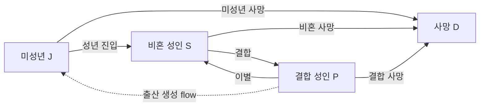

# Network System / Population

## Interface decision

- **Participant situation:** one participant changes a four-node population system while four screens expose its current stocks.
- **Primary parameter:** the seven annual flows between juvenile, single, partnered, and deceased population stocks.
- **Perceptual job:** notice that a changed rate alters later annual flows and only then changes the receiving screen's population.
- **Interaction job:** change one relation rate or add/remove five units of a stock without directly prescribing the next snapshot.
- **Wrapper justification:** the controller is the causal graph itself; the screens translate aggregate age cohorts into a crowd field so delayed structural change is visible without presenting a dashboard.
- **System family:** paper, graphite, one pictogram family, shared age morphology, and responsive density packing.
- **Removal test:** the graph, seven rate controls, four stock controls, simulation year, crowd field, and current count are necessary. Charts, badges, histories, status labels, and decorative chrome are omitted.

## Graph



The model is an age-structured stock/flow system, not an agent-based simulation. It never stores a person ID, individual biography, couple, or individual event history. Living stocks are three fixed arrays covering ages `0–110`; deceased is one cumulative stock. One annual step always performs a fixed amount of work over these arrays, whether the represented population is 200, 10,000, or one million.

Initial living population is 200: 36 juvenile, 68 single, and 96 partnered. This is only the reset condition. Birth, death, relation flows, and direct `±5` interventions may increase or decrease every later population value.

## Annual calculation

Real time `1 second` advances one simulation year. The socket clock tracks the next absolute year boundary and catches up missed boundaries before broadcasting, so event-loop delay does not silently stretch the model's calendar. Each step is ordered as follows:

1. Shift the three living age-cohort arrays by one year.
2. Calculate age-specific death flows from all three living stocks.
3. Move every surviving juvenile cohort at or above the adulthood threshold into the single stock.
4. Calculate union and separation from the post-death adult stocks simultaneously, preventing an artificial same-year separation/reunion loop.
5. Calculate the `partnered → juvenile` birth flow from partnered cohorts aged 18–44 and add it to juvenile age zero without consuming partnered stock.

For each living state and age, hidden retention completes the probability row:

```text
p(stay) + p(death) + p(state change) = 1
```

Increasing union or separation first reduces retention; it does not reduce mortality. If competing event rates ever exceed one, they are proportionally normalized. Birth is a generative edge rather than a destination choice, but remains a first-class graph flow with its own controller value and annual flow reading.

Default age-specific annual rates are experiential baselines, not demographic forecasts: mortality is `0.05%` at ages 0–17, `0.10%` at 18–39, `0.35%` at 40–59, `1%` at 60–69, `3%` at 70–79, `8%` at 80–89, and progressively capped at `35%` above 90. Union is `4%, 8%, 4%, 1.5%, 0.5%` across the declared adult bands; separation is `2.5%, 2%, 1.2%, 0.6%`.

## Controls and screens

The controller exposes exactly seven graph controls: adulthood age, three mortality multipliers, union multiplier, separation multiplier, and births per 100 couple-years. Every control shows both its persistent rate and the most recent annual flow. Four node controls add five units with a state-appropriate age distribution or remove five proportionally across the existing cohort distribution.

Screen mapping is `1 juvenile`, `2 single`, `3 deceased`, and `4 partnered`. Screen marks are a presentation of aggregate cohort density, not model entities. Up to 900 marks are drawn; above that threshold the same field samples the larger stock at higher density while the exact rounded stock remains visible. Juvenile marks change proportions at each age, adults change at five-year bands, partnered marks are spatially paired, and deceased stock uses graves. Single and `whole` routes calculate packing from their own pane sizes rather than scaling a fixed canvas.

Routes:

- `/network-system/controller/population`
- `/network-system/screen/population/1` through `/4`
- `/network-system/screen/population/whole`
